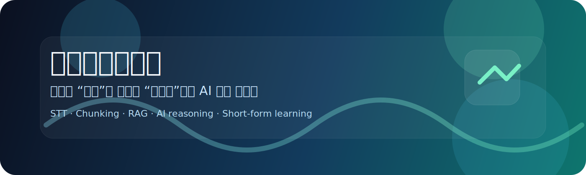
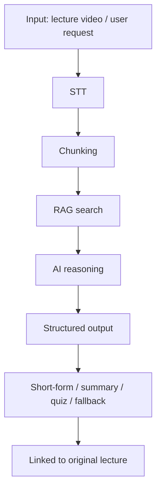

<p align="center">
  
</p>

<h3 align="center">강의를 “소비”가 아니라 “재구성”하는 AI 교육 플랫폼</h3>

<p align="center">
  AI 기반으로 강의를 분석하고, 필요한 구간만 추출해 개인화된 학습 경험을 제공합니다.
</p>

---

## Overview

`.github` 폴더는 이 저장소의 협업 기준과 자동화 규칙을 모아두는 운영 허브입니다.

제품 소개 문서가 아니라, 아래 항목처럼 **기여 방식과 리뷰 기준을 통일하는 문서/자동화 공간**입니다.

- PR/MR 템플릿
- Issue 템플릿
- CODEOWNERS
- GitHub Actions 워크플로

## Why This Project Exists

기존 온라인 강의는 짧게 쪼개져 보여도, 실제로 다시 학습할 때는 여전히 원하는 구간을 직접 찾아야 합니다.

`내맘대로(MyWayClass)`는 이 탐색 비용을 줄이기 위해:

- 강의 오디오를 텍스트로 바꾸고
- 의미 단위로 나누고
- RAG로 근거 구간을 찾고
- AI로 요약, 퀴즈, 질문 응답, 숏폼 생성을 수행합니다

핵심 목표는 단순히 영상을 자르는 것이 아니라, **학습 단위 자체를 다시 설계하는 것**입니다.

## Problem

기존 LMS의 구조적 한계는 콘텐츠의 부족이 아니라 탐색 비용에 있습니다.

- 5분짜리 영상 안에서도 실제 필요한 구간은 2~3분인 경우가 많습니다
- 원하는 개념을 찾기 위해 전체 영상을 반복 재생해야 합니다
- 영상 수가 늘수록 복습 경로가 길어집니다
- 고정된 재생 단위 때문에 개인화가 어렵습니다

## Solution

이 프로젝트는 강의를 다음 흐름으로 재구성합니다.

```text
Lecture video
  -> STT
  -> Chunking
  -> RAG retrieval
  -> AI reasoning
  -> Short-form / Summary / Quiz / Q&A
  -> Linked back to the original lecture
```

결과적으로 다음과 같은 학습 단위를 제공합니다.

- 시험 대비: 핵심 구간만 빠르게 확인
- 개념 학습: 정의 중심으로 재구성
- 복습: 요약과 퀴즈 기반 반복 학습
- 공유: 수강생끼리 학습 자산을 재활용

## Core Features

- AI 기반 숏폼 자동 생성
- 커스텀 강의 조립
- 질문 응답 및 요약
- 퀴즈 자동 생성
- 학습 상태 관리
- 숏폼 커뮤니티 및 공유

## Architecture



### Design Principle

LMS와 AI 레이어를 분리해, AI가 없더라도 기본 학습 흐름은 유지되도록 설계했습니다.

## AI Collaboration

이 저장소의 AI 협업 방식은 “프롬프트만 잘 쓰는 방식”이 아니라, **명세와 검증으로 통제하는 방식**입니다.

### Working Rules

- 작업 전에는 반드시 목적을 먼저 고정합니다
- 지시는 짧게 쓰되, 범위와 완료 기준은 분명히 씁니다
- 문서는 단일 진실 원천으로 사용합니다
- 변경 후에는 `docs/dev-logs/`에 판단 근거를 남깁니다

### Actual Workflow

```text
Design -> Document -> Implement -> Validate -> Log
```

### AI Role Separation

| Role | Tool | Responsibility |
|------|------|----------------|
| 설계 | Claude Opus | 아키텍처, 모듈 경계, 고수준 의사결정 |
| 구현 | Codex | 코드 수정, 반복 작업, 파일 단위 변경 |
| 추론 | AI Provider Layer | STT, 요약, 분류, 퀴즈, RAG 기반 응답 |

### Why This Matters

LLM은 확률 기반 시스템이라 같은 입력에도 결과가 달라질 수 있습니다.  
그래서 이 프로젝트는 AI를 직접 믿는 대신, 다음으로 통제합니다.

- 명세 기반 지시
- A/B 워킹트리 비교
- 타입 검증
- fallback 응답
- 문서 기록

실제 서비스 추론 경로는 환경에 따라 `demo`, `Ollama`, `Gemini`, `Cloudflare AI STT`를 조합하고,  
문서에 정의된 fallback 순서대로 동작합니다.

## Repository Conventions

이 폴더에서 관리하는 주요 규칙은 다음과 같습니다.

- `pull_request_template.md`: PR 작성 기준
- `MERGE_REQUEST_TEMPLATE.md`: 머지 요청 기준
- `ISSUE_TEMPLATE/`: 버그, 문서, 기능, 리팩터링 이슈 템플릿
- `CODEOWNERS`: 경로별 리뷰 책임
- `workflows/`: 브랜치 보호와 자동 리뷰 체크

## Validation

이 프로젝트는 다음 기준으로 변경을 검증합니다.

- JSON 파싱 검증
- TypeScript 타입 안정성
- fallback 동작 확인
- 사이드 이펙트 점검
- 관련 문서 동시 갱신

## Docs Structure

```text
docs/
├── project/
├── context/
├── conventions/
├── ai-context/
├── dev-logs/
└── structure/
```

## Summary

`내맘대로클래스`는 강의를 단순히 재생하는 LMS가 아니라,  
**강의의 의미 단위를 다시 조합해 학습 효율을 높이는 AI 교육 플랫폼**입니다.

이 `.github` 폴더는 그 철학을 실제 협업 규칙과 리뷰 자동화로 고정하는 운영 허브입니다.
