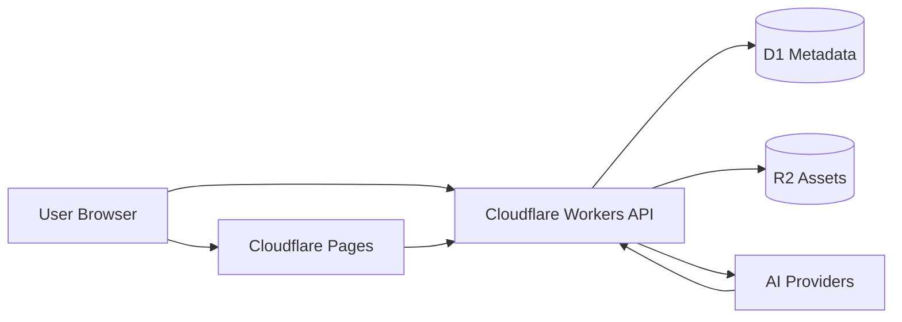

# 아키텍처

## 목적
시스템 경계, 데이터 흐름, 배포 모델을 설명한다.

## 역할
- 이 문서는 구현 기준의 상세 아키텍처다.
- 요약 허브는 `docs/context/architecture.md`다.
- context 문서와 같은 내용을 반복하지 않고, 실제 동작 기준을 적는다.

## 범위
- 브라우저와 API 사이의 흐름
- AI 오케스트레이션
- 메타데이터와 자산 저장
- 운영 환경과 데모 환경의 차이

## 입력
- 강의 데이터
- 사용자 요청
- AI 공급자 응답

## 출력
- 서비스 경계도
- 데이터 흐름 순서
- 런타임 책임 분배

## 규칙
- 브라우저는 API하고만 통신한다.
- Workers가 AI와 데이터 작업을 오케스트레이션한다.
- D1에는 메타데이터만 저장하고 긴 트랜스크립트나 미디어는 두지 않는다.
- R2에는 큰 산출물을 저장한다.

## 구조

## 핵심 흐름
- 강의 업로드 또는 등록
- 청킹과 임베딩
- RAG 질의응답
- STT와 타임스탬프 생성
- 숏폼 생성과 공유
- 커뮤니티 반응과 랭킹

## 예외 상황
- 데모 전용 단계는 반드시 문서에 표시한다.
- 일부 결과는 데모를 위해 미리 계산해 둘 수 있다.
- AI 실패 시에는 자연스럽게 fallback해야 한다.

## 실패 모드
- UI가 API 계약을 우회하는 경우
- 대량 데이터를 D1에 저장하는 경우
- 숨겨진 데모 로직을 운영 로직처럼 취급하는 경우

## 검증 기준
- 문서만 읽어도 시스템 경계가 보인다.
- 주요 흐름마다 책임 주체가 분명하다.
